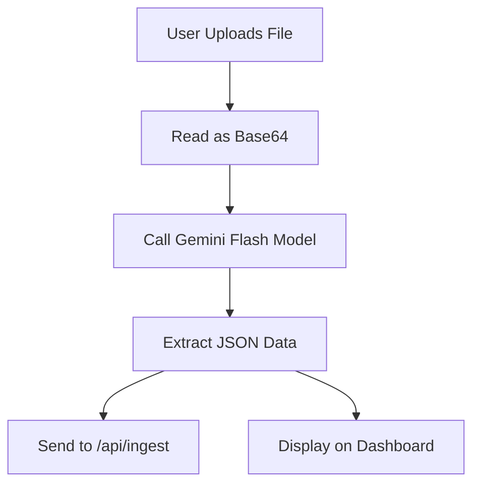
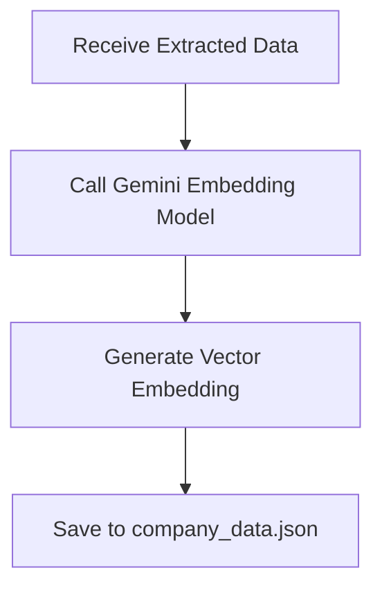
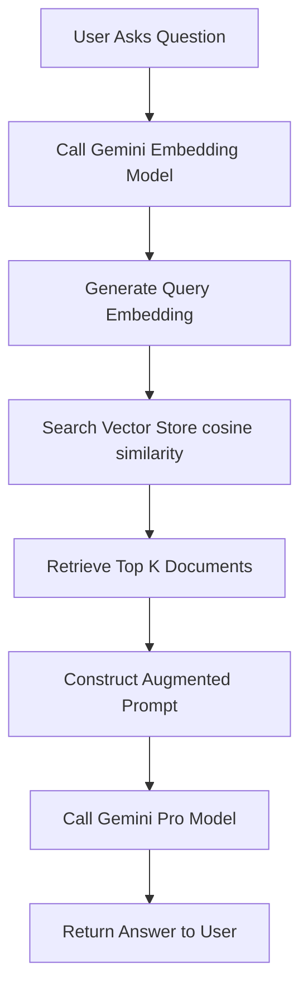

# AutoPilotX - How It Works

This document explains the internal workings of the AutoPilotX application, specifically focusing on the RAG (Retrieval-Augmented Generation) pipeline, the local vector database, and the AI integration.

## Tech Stack Overview

- **Frontend**: Next.js 15 (React 19), Tailwind CSS, Lucide React (Icons), React Dropzone (File Uploads), React Markdown.
- **Backend**: Next.js App Router API Routes (`/api/ingest`, `/api/chat`).
- **AI Models**:
  - `gemini-3-flash-preview`: Used for fast, structured document extraction (JSON).
  - `gemini-embedding-2-preview`: Used for generating vector embeddings of text.
    - `gemini-2.5-flash`: Used for the final chat generation (RAG).
- **Database**: A custom, lightweight, local JSON-based vector store (`lib/vector-store.ts`).

---

## 1. Document Upload & Extraction (`DocumentUpload.tsx`)

When a user uploads a document (PDF, JPG, PNG) on the Dashboard:

1. **File Reading**: The file is read as a Base64 string using `FileReader`.
2. **Extraction**: The Base64 string and MIME type are sent to the `gemini-3-flash-preview` model. The prompt asks the model to extract key information (e.g., GSTIN, total amount, line items) and return it as structured JSON.
3. **Ingestion**: Once the JSON is extracted, the raw text and JSON data are sent to the `/api/ingest` endpoint to be stored in the vector database.

---

## 2. Data Ingestion (`/api/ingest/route.ts`)

The ingestion API route receives the extracted text and metadata from the frontend.

1. **Embedding Generation**: It calls the `gemini-embedding-2-preview` model to generate a numerical vector representation (embedding) of the text.
2. **Storage**: It calls `addDocument` from `lib/vector-store.ts` to save the text, metadata, and the embedding array into the local `company_data.json` file.

---

## 3. Local Vector Store (`lib/vector-store.ts`)

This is a simple, file-based vector database designed for local prototyping.

- **`loadDB()`**: Reads the `company_data.json` file from the disk and parses it into an array of `Document` objects.
- **`saveDB()`**: Writes the array of `Document` objects back to the JSON file.
- **`cosineSimilarity(a, b)`**: A mathematical function that calculates the similarity between two vectors. A score closer to 1 means the vectors (and thus the texts) are semantically similar.
- **`addDocument()`**: Creates a new document object with a unique ID, text, and embedding, then saves it.
- **`searchDocuments()`**: Takes a query embedding, calculates the cosine similarity against all stored documents, sorts them by score, and returns the top `k` results.

---

## 4. Chat & Retrieval (`/api/chat/route.ts` & `memory/page.tsx`)

When the user asks a question on the "Memory" page:

1. **User Query**: The user types a question (e.g., "What is the total GST collected?").
2. **Query Embedding**: The `/api/chat` route receives the message and generates an embedding for the user's query using `gemini-embedding-2-preview`.
3. **Vector Search**: It calls `searchDocuments` to find the top 3 most relevant document chunks from the local vector store based on cosine similarity.
4. **Context Construction**: The retrieved text chunks are appended to the `DEFAULT_SYSTEM_PROMPT` as "Relevant Company Data".
5. **Generation**: The `gemini-2.5-flash` model is called with the user's query and the augmented system prompt. The model uses the provided context to answer the question accurately.
6. **Response**: The generated text is sent back to the frontend and displayed using `ReactMarkdown`.

